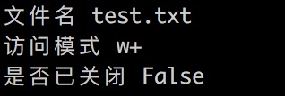

# Python文件操作

### open()

文件相关操作必须先用Python内置的open()函数打开一个文件，创建一个file对象，才能继续操作。

	fileObject = open('index.html' , 'w')
* `index.html`为文件名。
* `w`打开一个文件只用于写入。如果该文件已存在则将其覆盖。如果该文件不存在，创建新文件。其他模式如下图所示：

**其他属性**

代码：

输出结果：

### close()

File 对象的 close（）方法刷新缓冲区里任何还没写入的信息，并关闭该文件，这之后便不能再进行写入。

当一个文件对象的引用被重新指定给另一个文件时，Python 会关闭之前的文件。用 close（）方法关闭文件是一个很好的习惯。

语法：

	fileObject.close()
	
### write()

write()方法可将任何**字符串**写入一个打开的文件。需要重点注意的是，Python字符串可以是二进制数据，而不是仅仅是文字。

* write()方法不会在字符串的结尾添加换行符('\n')：

语法：
	
	fileObject.write(string)
	
### read()

read（）方法从一个打开的文件中读取一个字符串。

语法：

	fileObject.read([count])
	
* 参数用来限定读取的字节数